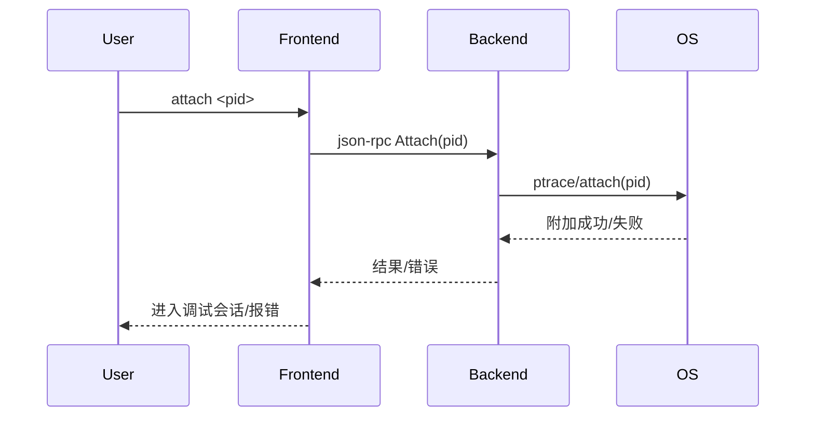

# 4.1 attach命令的设计与实现

## 4.1.1 功能概述

`attach` 命令用于将调试器附加到一个已存在的进程（tracee），实现对其运行状态的调试和控制。该命令常用于生产环境或服务进程的动态问题定位。

## 4.1.2 执行流程

1. 用户在前端输入 `attach <pid>` 命令。
2. 前端通过 json-rpc（远程）或 net.Pipe（本地）将 attach 请求发送给后端。
3. 后端解析请求，调用系统API（如 ptrace 或等效机制）附加到目标进程。
4. 后端初始化调试上下文（如符号表、断点、线程信息等）。
5. 返回 attach 结果，前端进入调试会话。

## 4.1.3 关键源码片段

```go
// 命令分发入口
func (c *Commands) Attach(pid int) error {
    req := &rpc.AttachRequest{Pid: pid}
    var resp rpc.AttachResponse
    err := c.client.Call("Attach", req, &resp)
    return err
}

// 后端处理逻辑
func (s *Server) Attach(req *AttachRequest, resp *AttachResponse) error {
    proc, err := process.Attach(req.Pid)
    if err != nil {
        return err
    }
    s.debugger = NewDebugger(proc)
    // 初始化符号、断点、线程等
    return nil
}
```

## 4.1.4 流程图



## 4.1.5 小结

attach 命令通过标准化的前后端通信和平台相关的进程附加机制，实现了对任意进程的动态调试，为生产环境问题定位提供了强大支持。 