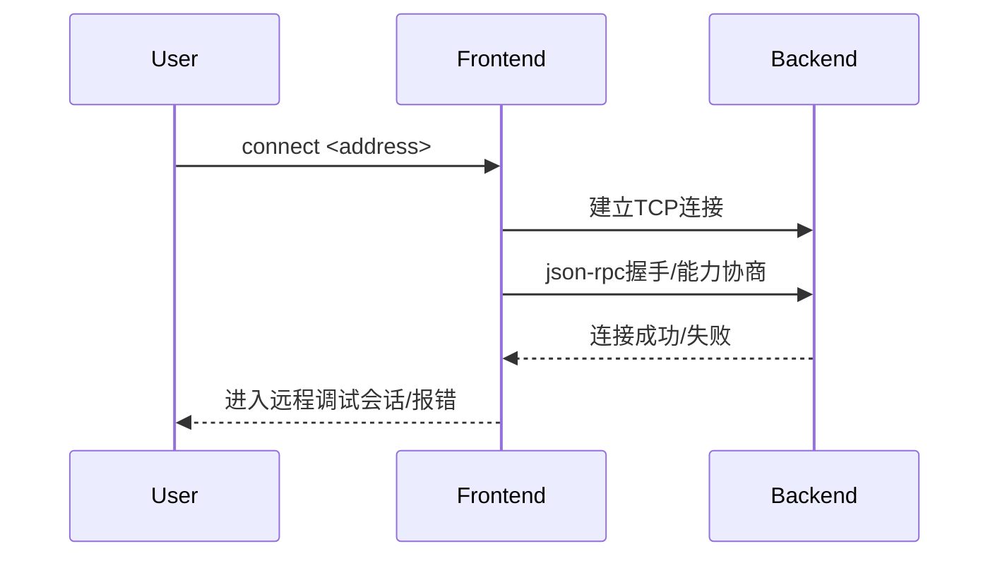

# 4.4 connect命令的设计与实现

## 4.4.1 功能概述

`connect` 命令用于将调试器前端连接到远程调试后端，适用于跨主机、跨平台的远程调试场景。

## 4.4.2 执行流程

1. 用户在前端输入 `connect <address>` 命令。
2. 前端解析地址，建立到远程后端的网络连接（如 TCP/Unix Socket）。
3. 前端通过 json-rpc 协议与后端进行握手和能力协商。
4. 连接成功后，前端进入远程调试会话。

## 4.4.3 关键源码片段

```go
// 命令分发入口
func (c *Commands) Connect(addr string) error {
    conn, err := net.Dial("tcp", addr)
    if err != nil {
        return err
    }
    c.client = jsonrpc.NewClient(conn)
    // 进行能力协商等初始化
    return nil
}

// 后端监听逻辑
func (s *Server) Listen(addr string) error {
    listener, err := net.Listen("tcp", addr)
    if err != nil {
        return err
    }
    for {
        conn, err := listener.Accept()
        if err != nil {
            continue
        }
        go s.serveConn(conn)
    }
}
```

## 4.4.4 流程图



## 4.4.5 小结

connect 命令为远程调试提供了标准化的入口，支持多种网络协议和能力协商，极大提升了调试器的跨平台和分布式能力。 