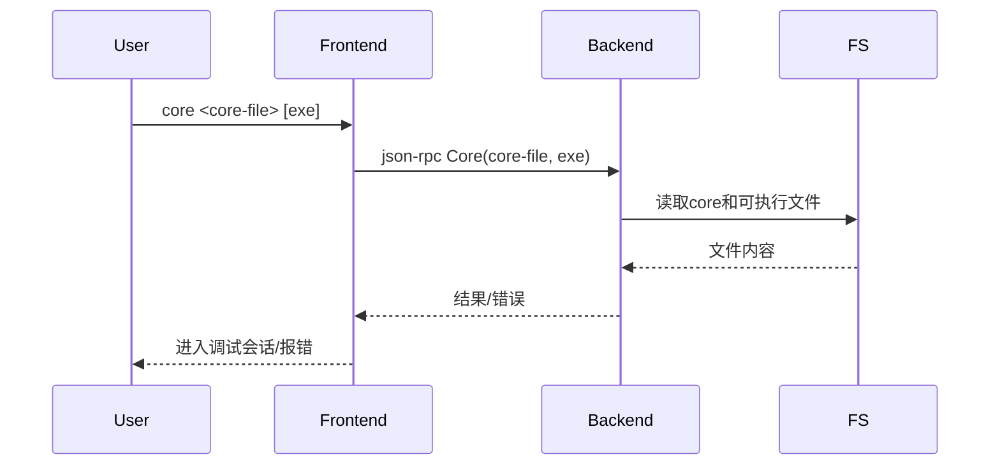

# 4.5 core命令的设计与实现

## 4.5.1 功能概述

`core` 命令用于加载 core dump 文件进行调试，支持对崩溃进程的回溯、变量查看和状态分析，常用于定位程序崩溃原因。

## 4.5.2 执行流程

1. 用户在前端输入 `core <core-file> [executable]` 命令。
2. 前端通过 json-rpc（远程）或 net.Pipe（本地）将 core 请求发送给后端。
3. 后端加载 core 文件和可执行文件，解析进程快照信息。
4. 后端初始化调试上下文（符号表、断点、线程、寄存器等）。
5. 返回 core 结果，前端进入调试会话。

## 4.5.3 关键源码片段

```go
// 命令分发入口
func (c *Commands) Core(corefile, exe string) error {
    req := &rpc.CoreRequest{CoreFile: corefile, Executable: exe}
    var resp rpc.CoreResponse
    err := c.client.Call("Core", req, &resp)
    return err
}

// 后端处理逻辑
func (s *Server) Core(req *CoreRequest, resp *CoreResponse) error {
    proc, err := process.LoadCore(req.CoreFile, req.Executable)
    if err != nil {
        return err
    }
    s.debugger = NewDebugger(proc)
    // 初始化符号、断点、线程、寄存器等
    return nil
}
```

## 4.5.4 流程图



## 4.5.5 小结

core 命令为 post-mortem 调试提供了强大支持，便于开发者分析崩溃现场、还原程序状态，是定位疑难 bug 的重要工具。 