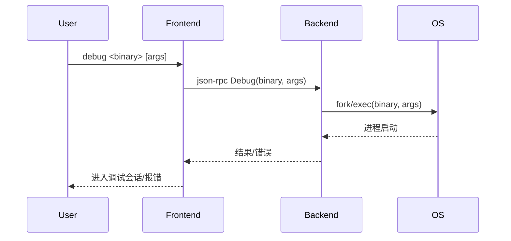

# 4.2 debug命令的设计与实现

## 4.2.1 功能概述

`debug` 命令用于以调试模式启动一个新的进程，并自动进入调试会话。适用于开发阶段对本地程序的全流程调试。

## 4.2.2 执行流程

1. 用户在前端输入 `debug <path-to-binary> [args...]` 命令。
2. 前端通过 json-rpc（远程）或 net.Pipe（本地）将 debug 请求发送给后端。
3. 后端 fork/exec 启动目标程序，并挂载调试器（如 ptrace）。
4. 后端初始化调试上下文（符号表、断点、线程等）。
5. 返回 debug 结果，前端进入调试会话。

## 4.2.3 关键源码片段

```go
// 命令分发入口
func (c *Commands) Debug(bin string, args []string) error {
    req := &rpc.DebugRequest{Binary: bin, Args: args}
    var resp rpc.DebugResponse
    err := c.client.Call("Debug", req, &resp)
    return err
}

// 后端处理逻辑
func (s *Server) Debug(req *DebugRequest, resp *DebugResponse) error {
    proc, err := process.Launch(req.Binary, req.Args)
    if err != nil {
        return err
    }
    s.debugger = NewDebugger(proc)
    // 初始化符号、断点、线程等
    return nil
}
```

## 4.2.4 流程图



## 4.2.5 小结

debug 命令通过自动化的进程启动与调试环境初始化，极大提升了开发阶段的调试效率，是本地调试的核心入口。 