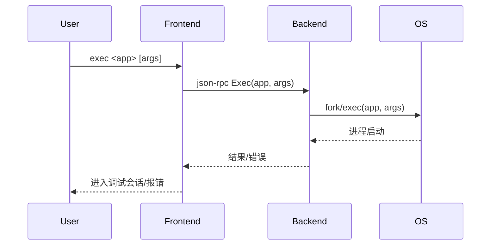

# 4.3 exec命令的设计与实现

## 4.3.1 功能概述

`exec` 命令用于直接执行并调试目标程序，通常与 `debug` 命令类似，但更偏向于无预处理地启动目标进程，适合快速调试和脚本化场景。

## 4.3.2 执行流程

1. 用户在前端输入 `exec <path-to-app> [args...]` 命令。
2. 前端通过 json-rpc（远程）或 net.Pipe（本地）将 exec 请求发送给后端。
3. 后端 fork/exec 启动目标程序，并立即附加调试器。
4. 后端初始化调试上下文（符号表、断点、线程等）。
5. 返回 exec 结果，前端进入调试会话。

## 4.3.3 关键源码片段

```go
// 命令分发入口
func (c *Commands) Exec(bin string, args []string) error {
    req := &rpc.ExecRequest{Binary: bin, Args: args}
    var resp rpc.ExecResponse
    err := c.client.Call("Exec", req, &resp)
    return err
}

// 后端处理逻辑
func (s *Server) Exec(req *ExecRequest, resp *ExecResponse) error {
    proc, err := process.Exec(req.Binary, req.Args)
    if err != nil {
        return err
    }
    s.debugger = NewDebugger(proc)
    // 初始化符号、断点、线程等
    return nil
}
```

## 4.3.4 流程图



## 4.3.5 小结

exec 命令为用户提供了快速、直接的调试入口，适合自动化脚本和批量调试场景，极大提升了调试器的灵活性。 