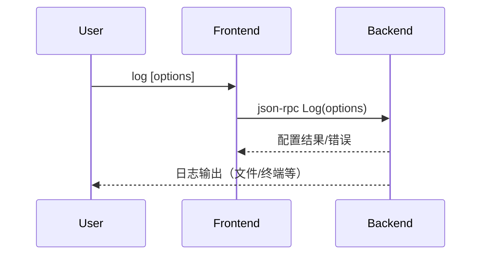

# 4.7 log命令的设计与实现

## 4.7.1 功能概述

`log` 命令用于记录调试过程中的日志信息，支持日志级别、输出目标等配置，便于问题追踪和调试分析。

## 4.7.2 执行流程

1. 用户在前端输入 `log [options]` 命令。
2. 前端通过 json-rpc（远程）或 net.Pipe（本地）将 log 配置请求发送给后端。
3. 后端根据请求设置日志级别、输出目标（如文件、终端、远程服务器等）。
4. 后端在调试过程中按配置输出日志。
5. 用户可随时调整日志配置或查看日志内容。

## 4.7.3 关键源码片段

```go
// 命令分发入口
func (c *Commands) Log(opts LogOptions) error {
    req := &rpc.LogRequest{Options: opts}
    var resp rpc.LogResponse
    err := c.client.Call("Log", req, &resp)
    return err
}

// 后端处理逻辑
func (s *Server) Log(req *LogRequest, resp *LogResponse) error {
    logger.SetLevel(req.Options.Level)
    logger.SetOutput(req.Options.Output)
    // 其他日志配置
    return nil
}
```

## 4.7.4 流程图



## 4.7.5 小结

log 命令为调试过程提供了灵活的日志管理能力，便于开发者追踪调试细节、分析问题根因。 