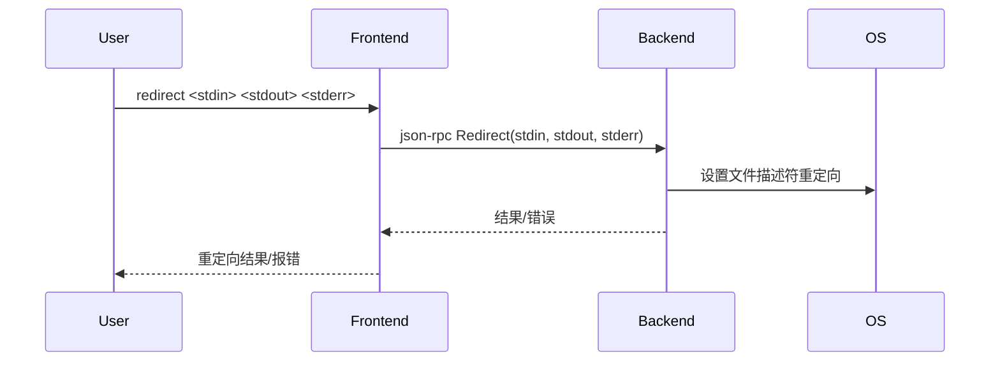

# 4.8 redirect命令的设计与实现

## 4.8.1 功能概述

`redirect` 命令用于将被调试进程（tracee）的标准输入、输出、错误流重定向到指定的文件或设备，适合自动化测试、日志采集等场景。

## 4.8.2 执行流程

1. 用户在前端输入 `redirect <stdin> <stdout> <stderr>` 命令。
2. 前端通过 json-rpc（远程）或 net.Pipe（本地）将 redirect 请求发送给后端。
3. 后端在启动或附加进程时，设置进程的文件描述符重定向。
4. 被调试进程的输入输出流被重定向到指定目标。
5. 用户可通过指定文件或设备获取或注入数据。

## 4.8.3 关键源码片段

```go
// 命令分发入口
func (c *Commands) Redirect(stdin, stdout, stderr string) error {
    req := &rpc.RedirectRequest{Stdin: stdin, Stdout: stdout, Stderr: stderr}
    var resp rpc.RedirectResponse
    err := c.client.Call("Redirect", req, &resp)
    return err
}

// 后端处理逻辑
func (s *Server) Redirect(req *RedirectRequest, resp *RedirectResponse) error {
    opts := process.RedirectOptions{
        Stdin:  req.Stdin,
        Stdout: req.Stdout,
        Stderr: req.Stderr,
    }
    err := s.debugger.SetRedirect(opts)
    return err
}
```

## 4.8.4 流程图



## 4.8.5 小结

redirect 命令为调试和自动化测试提供了灵活的输入输出流管理能力，便于数据采集和交互。 