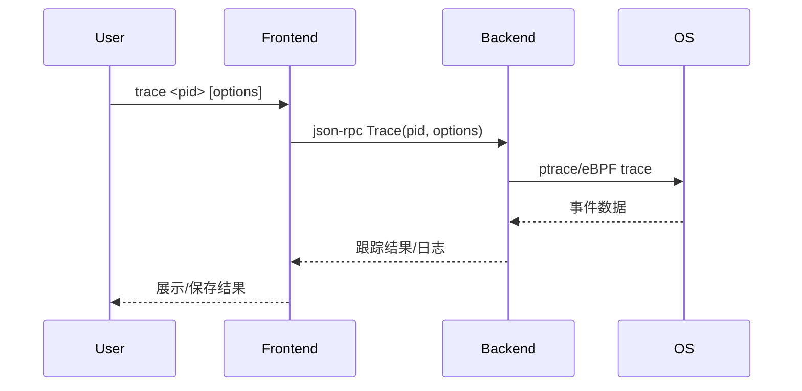

# 4.6 trace命令的设计与实现

## 4.6.1 功能概述

`trace` 命令用于对目标进程进行系统调用、信号或特定事件的跟踪，适合性能分析、异常检测和安全审计等场景。

## 4.6.2 执行流程

1. 用户在前端输入 `trace <pid> [options]` 命令。
2. 前端通过 json-rpc（远程）或 net.Pipe（本地）将 trace 请求发送给后端。
3. 后端调用系统API（如 ptrace、eBPF 等）对目标进程进行事件跟踪。
4. 后端实时收集并上报跟踪事件数据。
5. 前端展示跟踪结果或保存日志。

## 4.6.3 关键源码片段

```go
// 命令分发入口
func (c *Commands) Trace(pid int, opts TraceOptions) error {
    req := &rpc.TraceRequest{Pid: pid, Options: opts}
    var resp rpc.TraceResponse
    err := c.client.Call("Trace", req, &resp)
    return err
}

// 后端处理逻辑
func (s *Server) Trace(req *TraceRequest, resp *TraceResponse) error {
    tracer, err := trace.NewTracer(req.Pid, req.Options)
    if err != nil {
        return err
    }
    go tracer.Run()
    // 实时收集和上报事件
    return nil
}

// 获取匹配的函数列表
funcs, err := client.ListFunctions(regexp, traceFollowCalls)

// 为每个函数设置跟踪点
for i := range funcs {
    // 设置函数入口跟踪点
    _, err = client.CreateBreakpoint(&api.Breakpoint{
        FunctionName:     funcs[i],
        Tracepoint:       true,
        Line:            -1,
        Stacktrace:      stackdepth,
        LoadArgs:        &debug.ShortLoadConfig,
        TraceFollowCalls: traceFollowCalls,
        RootFuncName:    regexp,
    })

    // 设置函数返回跟踪点
    addrs, err := client.FunctionReturnLocations(funcs[i])
    for i := range addrs {
        _, err = client.CreateBreakpoint(&api.Breakpoint{
            Addr:            addrs[i],
            TraceReturn:     true,
            Stacktrace:      stackdepth,
            Line:           -1,
            LoadArgs:       &debug.ShortLoadConfig,
            TraceFollowCalls: traceFollowCalls,
            RootFuncName:   regexp,
        })
    }
}
```

## 4.6.4 流程图



## 4.6.5 小结

trace 命令通过集成系统级跟踪能力，为性能分析和异常检测提供了强大工具，支持多种事件类型和灵活的输出方式。 