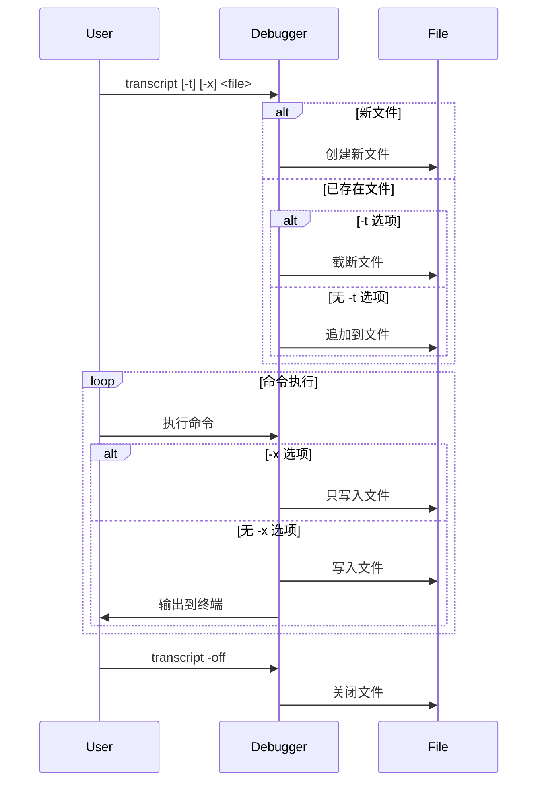

# 4.8 transcript命令的设计与实现

## 4.8.1 功能概述

`transcript` 命令用于将调试会话中的命令输出记录到文件中，支持追加或覆盖模式，并可选择是否同时输出到标准输出。这个功能对于保存调试会话记录、生成调试报告或进行后续分析非常有用。

## 4.8.2 执行流程

1. 用户在前端输入 `transcript [options] <output file>` 命令。
2. 前端解析命令参数，包括：
   - `-t`: 如果输出文件存在则截断
   - `-x`: 抑制标准输出
   - `-off`: 关闭转录功能
3. 后端根据配置打开或关闭文件输出流。
4. 在调试会话中，所有命令的输出都会被写入到指定的文件中。
5. 用户可以随时通过 `transcript -off` 停止记录。

## 4.8.3 关键源码片段

```go
var transcriptCmd = func(c *DebugSession) *command {
    return &command{
        aliases: []string{"transcript"},
        cmdFn:   transcript,
        helpMsg: `Appends command output to a file.

    transcript [-t] [-x] <output file>
    transcript -off

Output of Delve's command is appended to the specified output file. If '-t' is specified and the output file exists it is truncated. If '-x' is specified output to stdout is suppressed instead.

Using the -off option disables the transcript.`,
    }
}
```

## 4.8.4 流程图



## 4.8.5 小结

transcript 命令为调试会话提供了完整的输出记录功能，通过灵活的选项配置，可以满足不同的记录需求。这个功能对于调试过程的追踪、问题分析和知识分享都很有帮助。其设计充分考虑了实用性和灵活性，是调试工具中一个重要的辅助功能。 