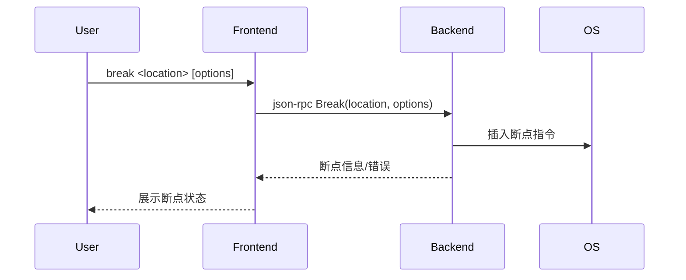

# 5.3 break命令的设计与实现

## 5.3.1 功能概述

`break` 命令用于在指定源码行、函数或地址处设置断点，便于程序在关键位置暂停，支持条件断点和多种断点类型。

## 5.3.2 执行流程

1. 用户在前端输入 `break <location> [options]` 命令。
2. 前端通过 json-rpc（远程）或 net.Pipe（本地）将 break 请求发送给后端。
3. 后端解析断点位置，插入断点指令（如int3/breakpoint trap），并记录断点信息。
4. 后端返回断点设置结果，前端展示断点状态。

## 5.3.3 关键源码片段

```go
// 命令分发入口
func (c *Commands) Break(loc string, opts BreakOptions) error {
    req := &rpc.BreakRequest{Location: loc, Options: opts}
    var resp rpc.BreakResponse
    err := c.client.Call("Break", req, &resp)
    return err
}

// 后端处理逻辑
func (s *Server) Break(req *BreakRequest, resp *BreakResponse) error {
    bp, err := s.debugger.SetBreakpoint(req.Location, req.Options)
    if err != nil {
        return err
    }
    resp.Breakpoint = bp
    return nil
}
```

## 5.3.4 流程图



## 5.3.5 小结

break 命令为调试会话提供了灵活的断点管理能力，是源码级调试和条件调试的基础。 