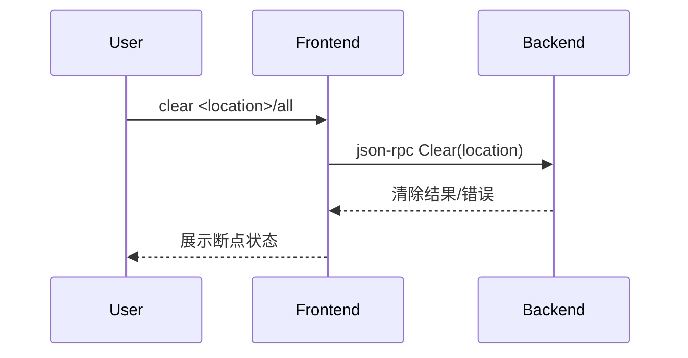

# 5.4 clear命令的设计与实现

## 5.4.1 功能概述

`clear` 命令用于清除指定位置或全部断点，便于动态调整调试流程和断点管理。

## 5.4.2 执行流程

1. 用户在前端输入 `clear <location>` 或 `clear all` 命令。
2. 前端通过 json-rpc（远程）或 net.Pipe（本地）将 clear 请求发送给后端。
3. 后端查找并移除对应断点，更新断点表。
4. 后端返回清除结果，前端展示断点状态。

## 5.4.3 关键源码片段

```go
// 命令分发入口
func (c *Commands) Clear(loc string) error {
    req := &rpc.ClearRequest{Location: loc}
    var resp rpc.ClearResponse
    err := c.client.Call("Clear", req, &resp)
    return err
}

// 后端处理逻辑
func (s *Server) Clear(req *ClearRequest, resp *ClearResponse) error {
    err := s.debugger.ClearBreakpoint(req.Location)
    return err
}
```

## 5.4.4 流程图



## 5.4.5 小结

clear 命令为断点管理提供了灵活的清除机制，便于调试过程中动态调整断点布局。 