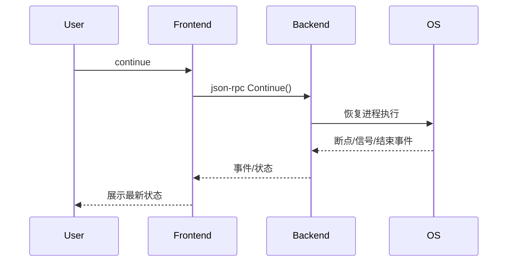

# 5.1 continue命令的设计与实现

## 5.1.1 功能概述

`continue` 命令用于让被调试程序从当前断点或暂停状态继续运行，直至下一个断点、信号或程序结束。

## 5.1.2 执行流程

1. 用户在前端输入 `continue` 命令。
2. 前端通过 json-rpc（远程）或 net.Pipe（本地）将 continue 请求发送给后端。
3. 后端恢复被调试进程的执行（如通过 ptrace 或等效API）。
4. 进程运行，遇到断点、信号或结束时，后端捕获事件并通知前端。
5. 前端展示最新状态或输出。

## 5.1.3 关键源码片段

```go
// 命令分发入口
func (c *Commands) Continue() error {
    var req rpc.ContinueRequest
    var resp rpc.ContinueResponse
    err := c.client.Call("Continue", &req, &resp)
    return err
}

// 后端处理逻辑
func (s *Server) Continue(req *ContinueRequest, resp *ContinueResponse) error {
    err := s.debugger.Continue()
    if err != nil {
        return err
    }
    // 检查断点/信号/结束等事件
    return nil
}
```

## 5.1.4 流程图



## 5.1.5 小结

continue 命令是调试会话中最常用的运行控制命令，配合断点、信号等机制，实现了高效的程序执行流管理。 