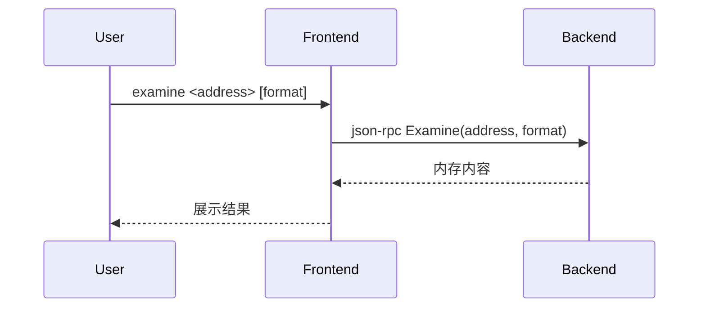

# 5.6 examine/x命令的设计与实现

## 5.6.1 功能概述

`examine`（或简写 `x`）命令用于查看指定内存地址的内容，支持多种格式（如十六进制、ASCII、指令等），便于底层调试和内存分析。

## 5.6.2 执行流程

1. 用户在前端输入 `examine <address> [format]` 或 `x <address> [format]` 命令。
2. 前端通过 json-rpc（远程）或 net.Pipe（本地）将 examine 请求发送给后端。
3. 后端解析地址和格式，读取目标内存内容，按指定格式进行展示。
4. 后端返回结果，前端展示内存内容。

## 5.6.3 关键源码片段

```go
// 命令分发入口
func (c *Commands) Examine(addr string, format string) error {
    req := &rpc.ExamineRequest{Address: addr, Format: format}
    var resp rpc.ExamineResponse
    err := c.client.Call("Examine", req, &resp)
    if err != nil {
        return err
    }
    fmt.Println(resp.Content)
    return nil
}

// 后端处理逻辑
func (s *Server) Examine(req *ExamineRequest, resp *ExamineResponse) error {
    content, err := s.debugger.ReadMemory(req.Address, req.Format)
    if err != nil {
        return err
    }
    resp.Content = content
    return nil
}
```

## 5.6.4 流程图



## 5.6.5 小结

examine/x 命令为底层调试和内存分析提供了强大工具，支持多种格式和灵活的内存查看方式。 