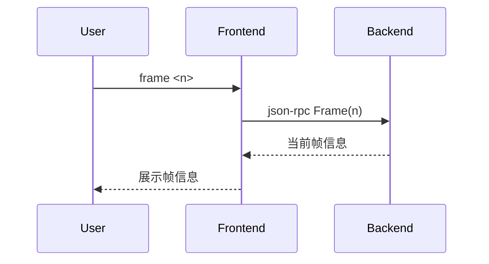

# 5.10 frame命令的设计与实现

## 5.10.1 功能概述

`frame` 命令用于切换当前调试上下文到指定的调用栈帧，便于查看和操作不同栈帧中的变量、参数和状态。

## 5.10.2 执行流程

1. 用户在前端输入 `frame <n>` 命令。
2. 前端通过 json-rpc（远程）或 net.Pipe（本地）将 frame 请求发送给后端。
3. 后端切换当前调试上下文到第n个栈帧，更新变量、寄存器等视图。
4. 后端返回切换结果，前端展示当前帧信息。

## 5.10.3 关键源码片段

```go
// 命令分发入口
func (c *Commands) Frame(n int) error {
    req := &rpc.FrameRequest{Index: n}
    var resp rpc.FrameResponse
    err := c.client.Call("Frame", req, &resp)
    if err != nil {
        return err
    }
    fmt.Printf("Switched to frame %d: %s at %s:%d\n", n, resp.Function, resp.File, resp.Line)
    return nil
}

// 后端处理逻辑
func (s *Server) Frame(req *FrameRequest, resp *FrameResponse) error {
    frame, err := s.debugger.SwitchFrame(req.Index)
    if err != nil {
        return err
    }
    resp.Function = frame.Function
    resp.File = frame.File
    resp.Line = frame.Line
    return nil
}
```

## 5.10.4 流程图



## 5.10.5 小结

frame 命令为多层调用栈调试提供了灵活的上下文切换能力，便于深入分析函数调用链和局部变量状态。 