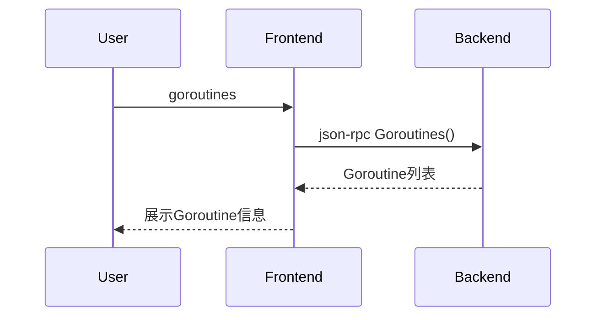

# 5.8 goroutines命令的设计与实现

## 5.8.1 功能概述

`goroutines` 命令用于列出Go语言程序中的所有Goroutine，展示其ID、状态、栈顶函数等信息，便于并发程序的调试和分析。

## 5.8.2 执行流程

1. 用户在前端输入 `goroutines` 命令。
2. 前端通过 json-rpc（远程）或 net.Pipe（本地）将 goroutines 请求发送给后端。
3. 后端遍历Goroutine表，收集每个Goroutine的ID、状态、栈顶函数等信息。
4. 后端返回Goroutine列表，前端展示所有Goroutine信息。

## 5.8.3 关键源码片段

```go
// 命令分发入口
func (c *Commands) Goroutines() error {
    var req rpc.GoroutinesRequest
    var resp rpc.GoroutinesResponse
    err := c.client.Call("Goroutines", &req, &resp)
    if err != nil {
        return err
    }
    for _, g := range resp.Goroutines {
        fmt.Printf("GID: %d, State: %s, TopFunc: %s\n", g.ID, g.State, g.TopFunc)
    }
    return nil
}

// 后端处理逻辑
func (s *Server) Goroutines(req *GoroutinesRequest, resp *GoroutinesResponse) error {
    gs := s.debugger.ListGoroutines()
    resp.Goroutines = gs
    return nil
}
```

## 5.8.4 流程图



## 5.8.5 小结

goroutines 命令为Go并发程序的调试提供了专用支持，便于开发者分析Goroutine的生命周期和调度状态。 