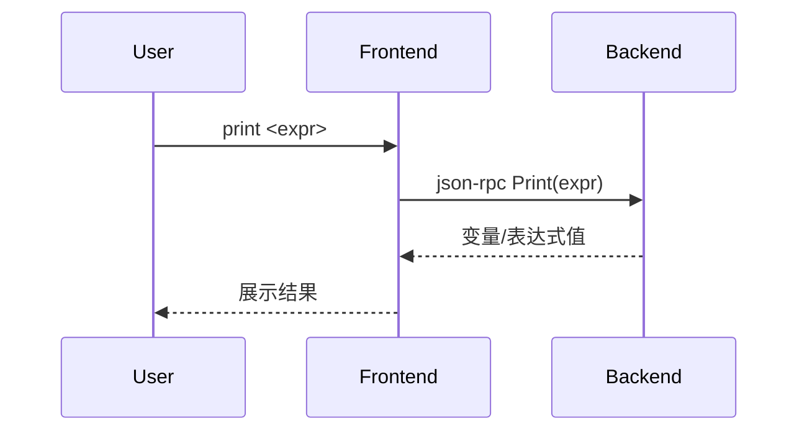

# 5.5 print/p命令的设计与实现

## 5.5.1 功能概述

`print`（或简写 `p`）命令用于查看变量、表达式或内存地址的值，支持多种数据类型和表达式求值。

## 5.5.2 执行流程

1. 用户在前端输入 `print <expr>` 或 `p <expr>` 命令。
2. 前端通过 json-rpc（远程）或 net.Pipe（本地）将 print 请求发送给后端。
3. 后端解析表达式，读取变量或内存值，进行类型推断和格式化。
4. 后端返回结果，前端展示变量值或表达式结果。

## 5.5.3 关键源码片段

```go
// 命令分发入口
func (c *Commands) Print(expr string) error {
    req := &rpc.PrintRequest{Expr: expr}
    var resp rpc.PrintResponse
    err := c.client.Call("Print", req, &resp)
    if err != nil {
        return err
    }
    fmt.Println(resp.Value)
    return nil
}

// 后端处理逻辑
func (s *Server) Print(req *PrintRequest, resp *PrintResponse) error {
    val, err := s.debugger.EvalExpression(req.Expr)
    if err != nil {
        return err
    }
    resp.Value = val.String()
    return nil
}
```

## 5.5.4 流程图



## 5.5.5 小结

print/p 命令为调试会话提供了灵活的变量和表达式查看能力，是定位程序状态和分析数据流的核心工具。 