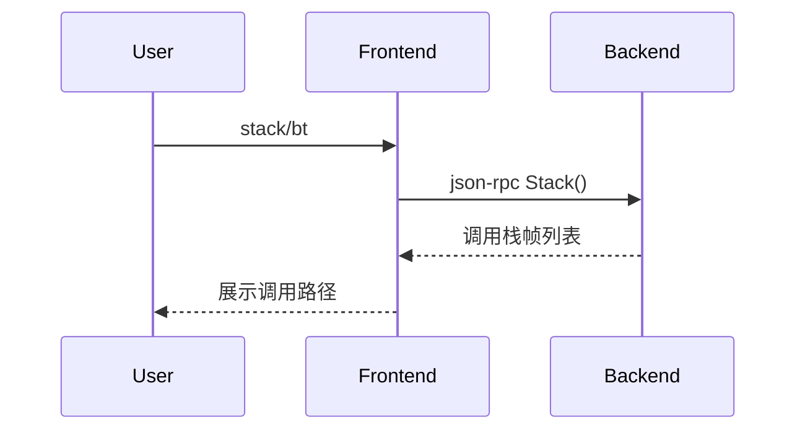

# 5.9 stack/bt命令的设计与实现

## 5.9.1 功能概述

`stack`（或 `bt`）命令用于查看当前线程或Goroutine的调用栈，展示每一帧的函数名、源码位置、参数等信息，便于分析程序执行路径和定位异常。

## 5.9.2 执行流程

1. 用户在前端输入 `stack` 或 `bt` 命令。
2. 前端通过 json-rpc（远程）或 net.Pipe（本地）将 stack 请求发送给后端。
3. 后端遍历当前线程/协程的调用栈，收集每一帧的信息。
4. 后端返回调用栈列表，前端展示完整的调用路径。

## 5.9.3 关键源码片段

```go
// 命令分发入口
func (c *Commands) Stack() error {
    var req rpc.StackRequest
    var resp rpc.StackResponse
    err := c.client.Call("Stack", &req, &resp)
    if err != nil {
        return err
    }
    for _, f := range resp.Frames {
        fmt.Printf("%s at %s:%d\n", f.Function, f.File, f.Line)
    }
    return nil
}

// 后端处理逻辑
func (s *Server) Stack(req *StackRequest, resp *StackResponse) error {
    frames := s.debugger.GetCallStack()
    resp.Frames = frames
    return nil
}
```

## 5.9.4 流程图



## 5.9.5 小结

stack/bt 命令为程序执行路径分析和异常定位提供了直观工具，是调试会话中不可或缺的功能。 