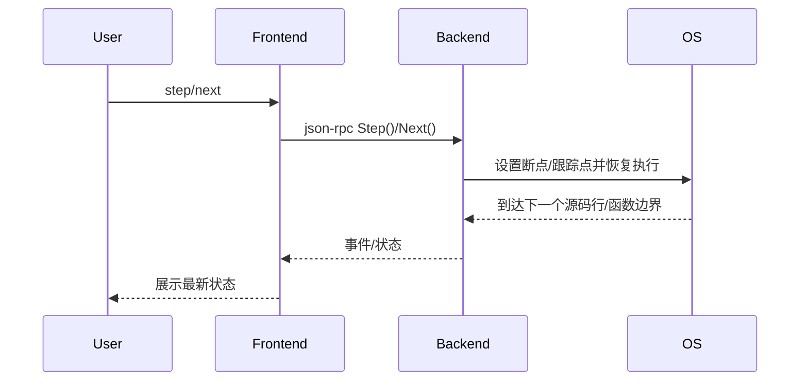

# 5.2 step/next命令的设计与实现

## 5.2.1 功能概述

`step` 和 `next` 命令用于单步调试：
- `step`（单步进入）：执行当前行并进入函数调用内部。
- `next`（单步跳过）：执行当前行但跳过函数调用，停在下一行。

## 5.2.2 执行流程

1. 用户在前端输入 `step` 或 `next` 命令。
2. 前端通过 json-rpc（远程）或 net.Pipe（本地）将 step/next 请求发送给后端。
3. 后端根据命令类型设置断点或跟踪点，恢复进程执行。
4. 进程运行到下一个源码行或函数边界时暂停，后端捕获事件并通知前端。
5. 前端展示最新状态或输出。

## 5.2.3 关键源码片段

```go
// 命令分发入口
func (c *Commands) Step() error {
    var req rpc.StepRequest
    var resp rpc.StepResponse
    err := c.client.Call("Step", &req, &resp)
    return err
}

func (c *Commands) Next() error {
    var req rpc.NextRequest
    var resp rpc.NextResponse
    err := c.client.Call("Next", &req, &resp)
    return err
}

// 后端处理逻辑
func (s *Server) Step(req *StepRequest, resp *StepResponse) error {
    err := s.debugger.Step()
    return err
}

func (s *Server) Next(req *NextRequest, resp *NextResponse) error {
    err := s.debugger.Next()
    return err
}
```

## 5.2.4 流程图



## 5.2.5 小结

step/next 命令为源码级单步调试提供了基础能力，便于开发者精确分析程序执行流程和函数调用关系。 