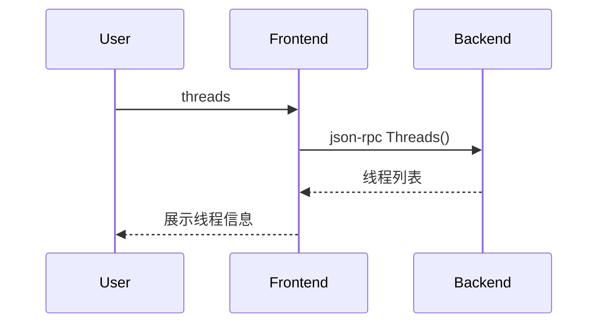

# 5.7 threads命令的设计与实现

## 5.7.1 功能概述

`threads` 命令用于列出被调试进程中的所有线程，展示线程ID、状态、当前执行位置等信息，便于多线程程序的调试和分析。

## 5.7.2 执行流程

1. 用户在前端输入 `threads` 命令。
2. 前端通过 json-rpc（远程）或 net.Pipe（本地）将 threads 请求发送给后端。
3. 后端遍历进程的线程表，收集每个线程的ID、状态、当前PC等信息。
4. 后端返回线程列表，前端展示所有线程信息。

## 5.7.3 关键源码片段

```go
// 命令分发入口
func (c *Commands) Threads() error {
    var req rpc.ThreadsRequest
    var resp rpc.ThreadsResponse
    err := c.client.Call("Threads", &req, &resp)
    if err != nil {
        return err
    }
    for _, t := range resp.Threads {
        fmt.Printf("TID: %d, State: %s, PC: 0x%x\n", t.ID, t.State, t.PC)
    }
    return nil
}

// 后端处理逻辑
func (s *Server) Threads(req *ThreadsRequest, resp *ThreadsResponse) error {
    threads := s.debugger.ListThreads()
    resp.Threads = threads
    return nil
}
```

## 5.7.4 流程图



## 5.7.5 小结

threads 命令为多线程程序的调试提供了全局视角，便于开发者分析并发执行状态和线程间的关系。 